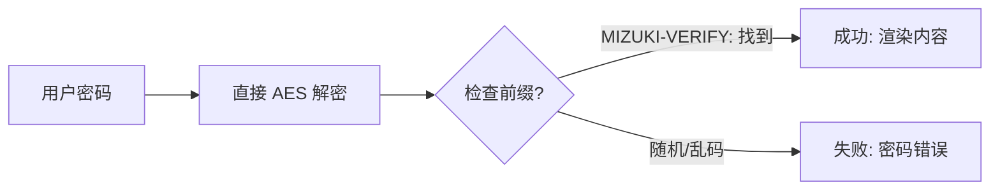

本博客模板基于 [Astro](https://astro.build/) 构建。有关本指南未提及的内容，你可以在 [Astro 文档](https://docs.astro.build/) 中找到答案。

## 文章 Front-matter

```yaml
---
title: 我的第一篇博客文章
published: 2023-09-09
description: 这是我的新 Astro 博客的第一篇文章。
image: ./cover.jpg
tags: [Foo, Bar]
category: 前端
draft: false
---
```

| 属性            | 描述                                                                                                                                                                                                            |
|-----------------|-----------------------------------------------------------------------------------------------------------------------------------------------------------------------------------------------------------------|
| `title`         | 文章的标题。                                                                                                                                                                                                    |
| `published`     | 文章的发布日期。                                                                                                                                                                                                |
| `pinned`        | 是否将文章置顶到文章列表顶部。                                                                                                                                                                                  |
| `description`   | 文章的简短描述。显示在首页上。                                                                                                                                                                                  |
| `image`         | 文章的封面图片路径。<br/>1. 以 `http://` 或 `https://` 开头：使用网络图片<br/>2. 以 `/` 开头：使用 `public` 目录中的图片<br/>3. 无以上前缀：相对于 markdown 文件所在位置                                           |
| `tags`          | 文章的标签。                                                                                                                                                                                                    |
| `category`      | 文章的分类。                                                                                                                                                                                                    |
| `alias`         | 文章的别名。文章可通过 `/posts/{alias}/` 访问。示例：`my-special-article`（可通过 `/posts/my-special-article/` 访问）                                                                                              |
| `licenseName`   | 文章内容的许可证名称。                                                                                                                                                                                          |
| `author`        | 文章的作者。                                                                                                                                                                                                    |
| `sourceLink`    | 文章内容的来源链接或参考。                                                                                                                                                                                      |
| `draft`         | 如果文章仍是草稿，将不会显示。                                                                                                                                                                                  |
| `encrypted`     | 是否启用密码保护。                                                                                                                                                                                              |
| `password`      | 解锁加密文章的密码。                                                                                                                                                                                            |
| `passwordHint`  | 帮助用户记住密码的提示。显示在密码输入框下方。                                                                                                                                                                  |
| `hideHomeContent` | 是否隐藏公开文章摘要，包括首页、meta 标签、feed/API 摘要以及分享预览。当设置了 `password` 时，默认为 `true`。                                                                                              |

## 文章文件存放位置

你的文章文件应放在 `src/content/posts/` 目录中。你也可以创建子目录来更好地组织文章和资源。

```
src/content/posts/
├── post-1.md
└── post-2/
    ├── cover.png
    └── index.md
```

## 文章别名

你可以通过添加 `alias` 字段为任何文章设置别名：

```yaml
---
title: 我的特殊文章
published: 2024-01-15
alias: "my-special-article"
tags: ["示例"]
category: "技术"
---
```

当设置了别名时：
- 文章可通过自定义 URL 访问（例如 `/posts/my-special-article/`）
- 默认的 `/posts/{slug}/` URL 仍然有效
- RSS/Atom 订阅将使用自定义别名
- 所有内部链接将自动使用自定义别名

**重要说明：**
- 别名不应包含 `/posts/` 前缀（会自动添加）
- 避免在别名中使用特殊字符和空格
- 使用小写字母和连字符以获得最佳 SEO 效果
- 确保所有文章的别名唯一
- 不要包含前导或尾随斜杠

## 工作原理



## 页面加密

你可以通过设置 `encrypted: true` 并在 front-matter 中提供 `password` 来为任何文章添加密码保护：

```yaml
---
title: 我的私人文章
published: 2024-01-15
encrypted: true
password: "my-secret-password"
passwordHint: "提示：密码是我家狗的名字"
hideHomeContent: true
---
```

### 字段说明

| 字段                | 必填 | 描述                                              |
|---------------------|------|---------------------------------------------------|
| `encrypted`         | 是   | 设置为 `true` 以启用密码保护                      |
| `password`          | 是   | 解锁文章的密码                                    |
| `passwordHint`      | 否   | 显示在密码输入框下方的提示，帮助用户回忆密码       |
| `hideHomeContent`   | 否   | 隐藏公开摘要，显示为 `该文章已加密`。设置 `password` 时默认为 `true`。设为 `false` 可显示正常摘要。 |

### 解锁框的显示效果

解锁框显示：
- 一个主题色的锁图标
- 文章标题"需要密码"
- 要求输入密码的提示文字
- 密码提示（如果提供了 `passwordHint`）
- 密码输入框和解锁按钮

输入正确密码后，内容会被解密并显示。密码存储在会话存储中，因此用户在同一个会话中无需重新输入。
